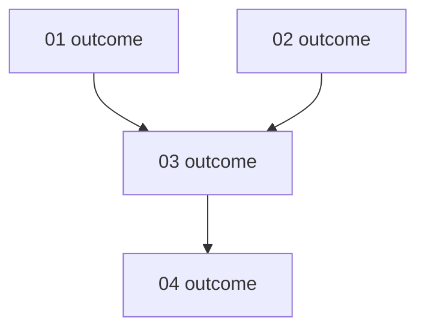

# create-crews

Turn one project `SPECIFICATION.md` into a set of independent work packages, each owned by its own crew, each with its own crisp specification and a single reconciliation anchor that acts as its build contract.
Firstmate is the decomposer here: this is planning and specification work, not coding, so firstmate does it directly and writes only the crew specifications, never project code.
The output is what firstmate would later hand to each crew as its brief source.

## Invocation

- `/create-crews <project>` resolves `<project>` against `projects/`, reads its root `SPECIFICATION.md`, and writes the crew and orchestrator specifications under `projects/<project>/crews/`.
- When `<project>` is omitted, resolve the project the way section 7 intake does (explicit referent, clear follow-up, or one confident registry match) and name it back to the captain before writing; ask one concise question when two or more or no projects plausibly match.
- Natural-language forms such as "break the spec for <project> into crews" are the same invocation.

## Write authority

Invoking `/create-crews <project>` is the captain's concrete, in-the-moment approval, under hard rule 1's concrete-project-operation exception, to create or replace files **only** under `projects/<project>/crews/`.
It authorizes nothing else in that project.
Never edit project source, `SPECIFICATION.md`, `AGENTS.md`, or any file outside `crews/`, never force, stash, or discard unlanded work, and never touch another project.
If `crews/` already holds specifications, replace them from the current `SPECIFICATION.md` rather than appending, and tell the captain the previous set was regenerated.

## Procedure

1. **Read the source of truth.**
   Read `projects/<project>/SPECIFICATION.md` in full.
   If it is absent or empty, stop and tell the captain there is no specification to decompose; do not invent one.

2. **Decompose into independent work packages.**
   Split the specification into the smallest set of packages such that each one can be built and verified on its own.
   Independence means each package owns a crisp input/output contract and shares no mutable state with another package; a package never needs to read another crew's internal decisions to do its work.
   Where package B consumes package A's output, that is not shared state - it is a boundary contract captured by A's reconciliation anchor and recorded as a sequential edge in the orchestrator, not a reason to merge them.
   Prefer packages drawn along seams the specification already exposes: distinct services, layers, endpoints, data contracts, or deliverable surfaces.
   Do not create a package the specification does not justify, and do not fold two genuinely separable deliverables into one crew.
   Name each package after the outcome it delivers, not the technology.

3. **Author one crew specification per package** using the crew specification format below.
   Each crew specification is derived only from `SPECIFICATION.md`; carry across exactly the requirements, contracts, and constraints that package needs, and nothing else.
   Every crew specification ends with exactly one reconciliation anchor in the required format.

4. **Author the orchestrator specification** using the orchestrator format below.
   It records which crews run in parallel and which run after another, justified by the boundary contracts found in step 2, and documents that ordering in a mermaid diagram.

5. **Write and report.**
   Create `projects/<project>/crews/` if needed, write every crew file and `orchestrator.md`, then give the captain a plain-language outcome: the project, how many crews, each crew's one-line goal, and which crews run in parallel versus in sequence.
   Do not paste the full specifications into chat; point to the files.

## Crew specification format

One file per crew at `projects/<project>/crews/<NN>-<slug>.md`, numbered in a sensible reading order (`01-`, `02-`, ...), slug drawn from the outcome.
The file is **extremely concise and sacrifices grammar for conciseness**: fragments over sentences, no filler, no restating the whole project, no prose the crew does not need to build.
Use this shape:

```markdown
# Crew: <outcome name>

Goal: <one line. the single outcome this crew ships.>

Scope:
- <in-scope deliverable, fragment>
- <in-scope deliverable, fragment>

Out:
- <explicitly out of scope, fragment>

Inputs:
- <contract/data/artifact this crew consumes, and from where. "none" if self-contained.>

Outputs:
- <contract/data/artifact this crew produces, exact shape>

Constraints:
- <hard requirement from SPECIFICATION.md, fragment>

## Reconciliation anchor

Given:    <the smallest realistic input>

When:     <the operation, named>

Expect:   <the exact output, to the last digit>

If this does not hold, the build is wrong. Do not
ship it.
```

## Reconciliation anchor

The anchor is the crew's build contract and is mandatory, exactly once per crew, in exactly this format:

```
## Reconciliation anchor

Given:    <the smallest realistic input>

When:     <the operation, named>

Expect:   <the exact output, to the last digit>

If this does not hold, the build is wrong. Do not
ship it.
```

Rules for filling it:

- `Given` is the smallest realistic concrete input, with real values, not a description of a kind of input.
- `When` names one operation the crew's deliverable performs.
- `Expect` is the exact, fully determined output to the last digit, character, status code, or field; never "roughly", never a range, never "should".
- Keep the closing two lines verbatim, including the line break after "Do not".
- If the specification does not pin an output precisely enough to write an exact `Expect`, choose the smallest case the specification does determine, and if none exists, stop and ask the captain for the missing acceptance value rather than inventing one.

## Orchestrator specification

Write `projects/<project>/crews/orchestrator.md`.
It is the workflow contract across crews: it states which crews run in parallel and which run after another, and why, then draws that ordering as a mermaid diagram.
Same conciseness rule as crew specs.

````markdown
# Orchestrator

Crews: <NN-slug>, <NN-slug>, ...

Order:
- Parallel: <crews with no dependency between them>
- Then: <crew> after <crew> because <the boundary contract it consumes>

## Workflow


````

Diagram rules:

- One node per crew, labelled `NN outcome`, matching the crew filenames.
- An edge `A --> B` means B starts only after A's output contract is met; crews with no path between them run in parallel.
- The graph is acyclic: a cycle means the packages are not independent and must be re-split in step 2.
- Every crew file appears as exactly one node.

## Guardrails

- Write only under `projects/<project>/crews/`; touch no other project file and no other project.
- The specifications you write are the source; do not spawn crews, open PRs, or start implementation - `/create-crews` produces the plan, not the build.
- If the decomposition cannot yield independent packages with exact reconciliation anchors from the current specification, say so plainly and name what the specification is missing, rather than papering over it.
